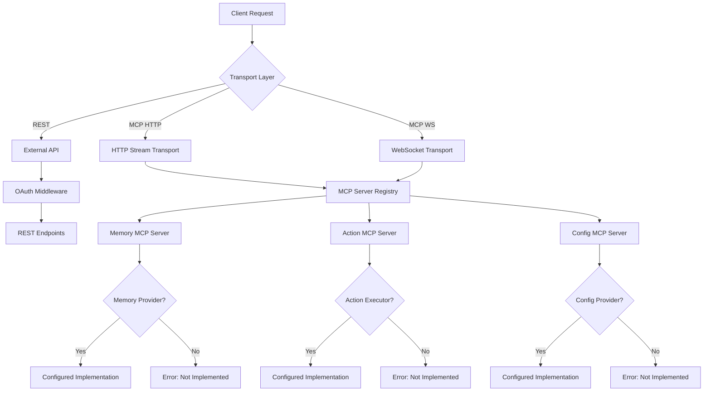

# systemprompt-os Architecture

## Overview

This document defines the architectural principles and organizational structure for systemprompt-os, designed to create a fully configurable platform for autonomous AI agents that aligns with our core mission: "An operating system for autonomous agents that run locally, remember persistently, and act purposefully."

## Architectural Principles

### 1. Configuration Over Convention
Every component should be replaceable through configuration. Users should be able to bring their own implementations for memory, security, scheduling, and other core features.

### 2. Interface-Driven Design
Define clear interfaces that allow users to plug in their own implementations rather than forcing specific solutions. All interfaces, types, and constants should be encapsulated within their respective modules, avoiding separate interface folders to maintain cohesion and reduce coupling.

### 3. Local-First Philosophy
Every component should be designed to work offline-first, with network features as optional enhancements.

### 4. Minimal Core
The core should only provide the essential orchestration layer and interfaces, allowing users to configure everything else.

### 5. Transparent Architecture
All system behaviors should be inspectable, configurable, and replaceable by the user.

## Directory Structure

```
systemprompt-os/
├── bin/                         # Executable entry point
│   └── systemprompt            # Main CLI executable
├── src/                         # All source code
│   ├── server/                 # Server implementations
│   │   ├── external/          # External API endpoints
│   │   │   ├── rest/         # REST API
│   │   │   │   ├── oauth2/  # OAuth2 Provider (systemprompt-os acts as identity provider)
│   │   │   │   │   ├── authorize.ts    # GET/POST /oauth2/authorize - Authorization endpoint
│   │   │   │   │   ├── token.ts        # POST /oauth2/token - Token exchange  
│   │   │   │   │   ├── userinfo.ts     # GET /oauth2/userinfo - User information
│   │   │   │   │   └── well-known.ts   # GET /.well-known/openid-configuration - Discovery
│   │   │   │   ├── health.ts      # GET /health - Returns CPU, memory, disk, OS info
│   │   │   │   └── status.ts      # GET /status - MCP server & provider status
│   │   │   └── middleware/   # Express middleware
│   │   │       ├── auth.ts  # Validates OAuth tokens for protected routes
│   │   │       └── cors.ts  # CORS configuration
│   │   ├── mcp/               # MCP server(s)
│   │   │   ├── core/         # Core MCP server (always available)
│   │   │   │   ├── server.ts # Core server implementation
│   │   │   │   └── handlers/ # Core handlers
│   │   │   │       ├── tools/        # Core tools
│   │   │   │       ├── prompts/      # Prompt templates
│   │   │   │       └── resources/    # Resource handlers
│   │   │   ├── custom/       # User-defined MCP servers
│   │   │   │   └── .gitkeep  # Custom servers added by users
│   │   │   ├── registry.ts    # Server registry
│   │   │   └── types.ts       # MCP types
│   │   ├── index.ts           # Server entry point
│   │   ├── config.ts          # Server configuration
│   │   ├── middleware.ts      # Common middleware
│   │   └── types.ts           # Server types
│   │
│   ├── modules/                # System modules - all functionality lives here
│   │   ├── core/              # Core modules (required, built-in)
│   │   │   ├── heartbeat/    # System health monitoring (daemon)
│   │   │   │   ├── module.yaml    # type: daemon, interval: 30s
│   │   │   │   ├── index.ts       # Heartbeat implementation
│   │   │   │   ├── types.ts       # Status types
│   │   │   │   ├── cli/          # Module CLI commands (optional)
│   │   │   │   │   └── status.ts # systemprompt heartbeat:status
│   │   │   │   └── README.md     # Module documentation
│   │   │   ├── oauth2/       # OAuth2 authentication (plugin)
│   │   │   │   ├── module.yaml    # type: plugin, provides: auth
│   │   │   │   ├── index.ts       # OAuth2 provider
│   │   │   │   ├── handlers/     # Route handlers
│   │   │   │   ├── cli/          # Module CLI commands (optional)
│   │   │   │   │   └── token.ts  # systemprompt oauth2:token
│   │   │   │   └── README.md     # Module documentation
│   │   │   ├── scheduler/    # Core task scheduler (service)
│   │   │   │   ├── module.yaml    # type: service
│   │   │   │   ├── index.ts       # Scheduler service
│   │   │   │   ├── cli/          # Module CLI commands (optional)
│   │   │   │   │   ├── list.ts   # systemprompt scheduler:list
│   │   │   │   │   └── run.ts    # systemprompt scheduler:run
│   │   │   │   └── README.md     # Module documentation
│   │   │   └── logger/       # System logging (service)
│   │   │       ├── module.yaml    # type: service
│   │   │       ├── index.ts       # Logger implementation
│   │   │       └── README.md      # Module documentation
│   │   │
│   │   ├── custom/            # Custom modules (user-defined)
│   │   │   └── .gitkeep      # Custom modules added by users
│   │   │
│   │   ├── registry.ts         # Module registry
│   │   └── README.md          # Module system documentation
│   │
│   ├── config/                 # Default configurations
│   │   ├── instructions/      # Agent instruction sets
│   │   │   ├── default.md    # Default agent instructions
│   │   │   └── custom/       # User-defined instructions
│   │   ├── settings/         # System settings
│   │   │   ├── system.yaml   # Core system configuration
│   │   │   ├── providers.yaml # Provider configurations
│   │   │   └── environments/ # Environment-specific settings
│   │   └── connectors/       # External API configurations
│   │       ├── gemini.yaml   # An example Gemini API connector
│   │       └── custom/       # User-defined connectors
│   │
│   ├─- cli/               # Main CLI implementation
│   │       └── src/          # Source code
│   │           ├── commands/ # Core CLI commands (always available)
│   │           │   ├── start.ts   # systemprompt start
│   │           │   ├── stop.ts    # systemprompt stop
│   │           │   ├── status.ts  # systemprompt status
│   │           │   └── help.ts    # systemprompt --help
│   │           ├── discovery.ts    # Module command discovery
│   │           └── index.ts       # CLI entry point
│   │
│   └── index.ts               # Main entry point
│
├── extensions/                  # User-defined extensions
│   ├── servers.yaml            # Custom MCP server definitions
│   ├── modules.yaml            # Custom module definitions
│   ├── servers/                # Local server implementations
│   │   └── .gitkeep           # Custom server code
│   └── modules/                # Local module implementations
│       └── .gitkeep           # Custom module code
│
├── state/                       # Runtime state and resources (configurable via STATE_DIR env)
│   ├── logs/                   # Application logs
│   │   ├── system.log         # Main system log
│   │   ├── error.log          # Error log
│   │   └── access.log         # HTTP access log
│   ├── data/                   # Persistent runtime data
│   │   ├── heartbeat.json     # System heartbeat status
│   │   ├── metrics.json       # Runtime metrics
│   │   └── sessions/          # Active session data
│   └── temp/                   # Temporary files
│       └── .gitkeep           # Cleaned on startup
│
├── docs/                        # Documentation
│   ├── architecture/           # Architecture docs
│   ├── guides/                 # User guides
│   ├── api/                    # API documentation
│   └── mission/                # Mission-specific docs
│
├── tests/                       # Test suites (Vitest-based)
│   ├── unit/                   # Unit tests - isolated component testing
│   │   ├── server-config.test.ts  # Server configuration tests
│   │   ├── mcp-server.test.ts     # MCP server tests
│   │   ├── cli.test.ts            # CLI command tests
│   │   └── example.test.ts        # Example test patterns
│   ├── integration/            # Integration tests - component interaction
│   │   ├── server-startup.test.ts # Server startup & health checks
│   │   └── mcp-integration.test.ts # MCP server registry integration
│   ├── e2e/                    # End-to-end tests - full system flows
│   │   ├── cli-commands.test.ts   # CLI command execution flows
│   │   └── oauth-flow.test.ts     # Complete OAuth2 authorization flows
│   └── fixtures/               # Shared test data and utilities
│       └── test-config.ts      # Mock configurations and test data
│
├── build/                       # Compiled output (gitignored)
├── node_modules/               # Dependencies (gitignored)
├── package.json                # Project configuration
├── tsconfig.json               # TypeScript configuration
├── .env.example                # Environment variables template
└── README.md                   # Project documentation

## Module System

systemprompt-os uses a module system where all functionality is organized into self-contained modules. Each module has a clear type that defines its lifecycle and behavior:

### Module Types

1. **Daemon Modules** (`type: daemon`)
   - Long-running background processes
   - Start automatically with the system
   - Examples: heartbeat monitoring, metric collection
   - Config: `interval`, `autoStart`

2. **Service Modules** (`type: service`)
   - Provide core functionality to other modules
   - Initialized once and shared across the system
   - Examples: logging, scheduling, event bus
   - Config: `singleton`, `dependencies`

3. **Plugin Modules** (`type: plugin`)
   - Extend system capabilities
   - Loaded on-demand when needed
   - Examples: auth providers, memory backends, storage adapters
   - Config: `provides`, `requires`, `options`

### Module Configuration (module.yaml)

```yaml
# Example: Heartbeat daemon module
name: heartbeat
type: daemon
version: 1.0.0
description: System health monitoring
config:
  interval: 30s
  outputPath: ./state/heartbeat.json
  autoStart: true

# Example: OAuth2 plugin module  
name: oauth2
type: plugin
version: 1.0.0
description: OAuth2 authentication provider
provides: auth
requires:
  - logger
config:
  endpoints:
    - /oauth2/authorize
    - /oauth2/token
```

### Module Structure

Each module should be self-contained with all related code co-located:

```
modules/core/logger/
├── index.ts        # Main module implementation & interfaces
├── types.ts        # Module-specific types (if needed)
├── cli/           # CLI commands (optional)
│   └── types.ts   # CLI-specific types
└── README.md      # Module documentation
```

**Key Principles:**
- **Co-location**: Keep interfaces, types, and constants with their implementations
- **No separate interface folders**: Avoid `src/interfaces/` or similar structures
- **Export from module**: Export public interfaces from the module's index file
- **Internal types**: Keep internal types private unless needed by other modules

**Example:**
```typescript
// src/modules/registry.ts - GOOD: Interfaces defined where they're used
export interface Module {
  name: string;
  version: string;
  // ...
}

export interface ServiceModule<T> extends Module {
  type: 'service';
  getService(): T;
}

export class ModuleRegistry {
  // Implementation using the interfaces
}

// src/interfaces/module.ts - BAD: Separate interface file
// This pattern should be avoided
```

### Module Lifecycle

- **Daemons**: Initialize → Start → Run (continuous) → Stop
- **Services**: Initialize → Ready (stays loaded)
- **Plugins**: Load → Initialize → Execute → Unload (optional)

### Module CLI Commands

Modules can provide CLI commands by including a `cli/` directory with command definitions:

```yaml
# module.yaml
name: heartbeat
type: daemon
cli:
  commands:
    - name: status
      description: Show heartbeat status
    - name: reset
      description: Reset heartbeat state
```

Commands are namespaced by module name:
- `systemprompt heartbeat:status`
- `systemprompt oauth2:token`
- `systemprompt scheduler:list`

The CLI discovers and registers these commands automatically during startup.

## Testing Strategy

The project uses Vitest as the testing framework with three distinct test levels:

1. **Unit Tests** (`npm run test:unit`)
   - Fast, isolated tests for individual components
   - No external dependencies or network calls
   - Run on every commit

2. **Integration Tests** (`npm run test:integration`)
   - Test component interactions
   - May use test databases or mock services
   - Run before merging

3. **E2E Tests** (`npm run test:e2e`)
   - Test complete user workflows
   - Full system testing including OAuth flows
   - Run before releases

See `docs/mission/testing.md` for detailed testing philosophy and guidelines.

## State Directory

The `state/` directory contains all runtime-generated files including logs, metrics, and temporary data. This directory is configurable via the `STATE_DIR` environment variable, allowing deployment flexibility:

- **Default location**: `./state` (relative to project root)
- **Production example**: `STATE_DIR=/var/lib/systemprompt-os`
- **Docker example**: `STATE_DIR=/app/state` (mounted volume)

### State Directory Structure

- `logs/` - Application logs (rotated daily)
  - `system.log` - General application logs
  - `error.log` - Error logs only
  - `access.log` - HTTP access logs
- `data/` - Persistent runtime data
  - `heartbeat.json` - Latest system health snapshot
  - `metrics.json` - Performance metrics
  - `sessions/` - Active session storage
- `temp/` - Temporary files (cleared on startup)

### Configuration

```bash
# .env file
STATE_DIR=/custom/path/to/state  # Optional, defaults to ./state
LOG_LEVEL=info                   # Log verbosity: debug, info, warn, error
LOG_MAX_SIZE=10m                 # Max log file size before rotation
LOG_MAX_FILES=7                  # Number of log files to keep
```

The state directory is exposed via:
- REST API: `/health` and `/status` endpoints read from state data
- MCP Tools: `system_info` tool accesses state directory for metrics
```

## MCP Server Architecture

### MCP Server Types

systemprompt-os supports two types of MCP servers:

#### 1. **Local Embedded MCP Servers**
- Implemented as Express request handlers
- Run within the systemprompt-os process
- Direct integration with minimal overhead
- Example: Core MCP server, custom handlers

**Structure:**
```typescript
// Exports a function that creates an Express handler
export function createMCPHandler(): express.RequestHandler {
  return async (req, res) => {
    // Handle MCP protocol requests
  };
}
```

#### 2. **Remote MCP Servers**
- Standalone services accessible via HTTP/HTTPS
- Run as separate processes or on different machines
- Accessed through proxy URLs
- Example: GitHub MCP server, external services

**Structure:**
```yaml
# Configuration for remote server
name: github-mcp
type: remote
url: https://api.github.com/mcp
auth:
  type: bearer
  token: ${GITHUB_TOKEN}
```

### MCP Server Registry

The registry (`src/server/mcp/registry.ts`) manages both types:
- Local servers: Directly mounts Express handlers
- Remote servers: Creates proxy handlers that forward requests

## Data Flow Architecture



## Extensions System

systemprompt-os supports a flexible extensions system that allows users to add custom MCP servers and modules without modifying the core codebase. Extensions can be either local (code in the extensions directory) or remote (accessed via URL).

### Extension Types

1. **Local Extensions**: Code that lives in the `extensions/` directory and is symlinked to the appropriate location in `src/`
2. **Remote Extensions**: External services accessed via URL with authentication

### Extension Configuration

Extensions are defined through YAML configuration files:

- `extensions/servers.yaml` - Defines custom MCP servers
- `extensions/modules.yaml` - Defines custom modules

### Extension Loading

The extension registry loads configurations at startup and:
- For local extensions: Creates symlinks to `src/server/mcp/custom/` or `src/modules/custom/`
- For remote extensions: Registers proxy handlers that forward requests

See `docs/extensions.md` for detailed documentation on creating and managing extensions.