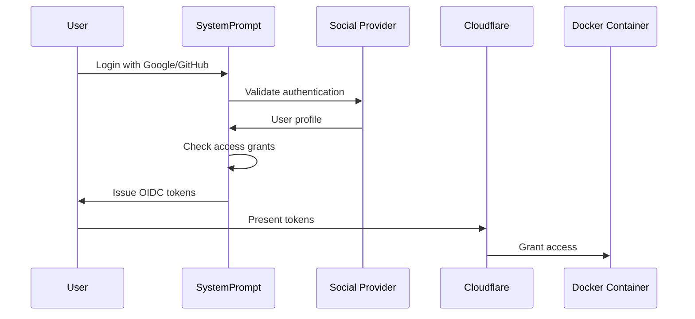

# Cloudflare Zero Trust Integration Guide

## Overview

This guide explains how to integrate SystemPrompt as an Identity Provider (IDP) for Cloudflare Zero Trust, enabling users to manage access to their Docker containers through a centralized dashboard with mobile/social login support.

## Architecture

```
Mobile/Social Login → SystemPrompt IDP → Cloudflare Zero Trust → User Docker Containers
```

### Key Components

1. **SystemPrompt IDP**: Acts as an OIDC provider for Cloudflare
2. **Social Login**: Google, GitHub, Microsoft authentication
3. **Multi-tenant Isolation**: Each user gets their own Docker container
4. **Access Management**: Users can grant/revoke access to others
5. **Cloudflare Tunnels**: Secure access without exposed ports

## Authentication Flow

### 1. User Registration/Login



### 2. Access Grant Flow

When User A grants access to User B:

1. User A adds User B's email in dashboard
2. SystemPrompt creates access grant record
3. User B logs in with their social account
4. SystemPrompt includes granted containers in User B's token claims
5. Cloudflare validates claims and grants access

## Implementation Requirements

### 1. OIDC Endpoints

SystemPrompt must implement these endpoints for Cloudflare:

- `/.well-known/openid-configuration` - Discovery endpoint
- `/auth/authorize` - Authorization endpoint
- `/auth/token` - Token exchange endpoint
- `/auth/userinfo` - User information endpoint
- `/.well-known/jwks.json` - Public keys for token validation

### 2. Social Login Providers

Configure OAuth applications with:

- **Google**: https://console.cloud.google.com
- **GitHub**: https://github.com/settings/developers
- **Microsoft**: https://portal.azure.com

### 3. Database Schema

```sql
-- Users table
CREATE TABLE users (
  id UUID PRIMARY KEY,
  email VARCHAR(255) UNIQUE,
  name VARCHAR(255),
  picture VARCHAR(500),
  auth_provider VARCHAR(50),
  provider_id VARCHAR(255),
  created_at TIMESTAMP,
  last_login TIMESTAMP
);

-- Containers table
CREATE TABLE containers (
  id UUID PRIMARY KEY,
  user_id UUID REFERENCES users(id),
  container_name VARCHAR(255),
  tunnel_id VARCHAR(255),
  tunnel_token TEXT,
  status VARCHAR(50),
  created_at TIMESTAMP
);

-- Access grants table
CREATE TABLE access_grants (
  id UUID PRIMARY KEY,
  grantor_id UUID REFERENCES users(id),
  grantee_email VARCHAR(255),
  container_id UUID REFERENCES containers(id),
  permissions JSON,
  created_at TIMESTAMP,
  expires_at TIMESTAMP,
  revoked_at TIMESTAMP NULL,
  INDEX idx_grantee_email (grantee_email)
);
```

### 4. Token Claims Structure

ID tokens issued to users must include:

```json
{
  "sub": "user-uuid",
  "email": "user@example.com",
  "name": "User Name",
  "picture": "https://...",
  "auth_provider": "google",
  "tenant_id": "user-uuid",
  "accessible_containers": [
    {
      "container_id": "container-uuid",
      "tunnel_name": "user-a-container",
      "permissions": ["read", "write", "admin"],
      "granted_by": "owner@example.com",
      "expires_at": "2024-12-31T23:59:59Z"
    }
  ],
  "iat": 1234567890,
  "exp": 1234571490,
  "iss": "https://systemprompt.com"
}
```

### 5. Cloudflare Configuration

In Cloudflare Zero Trust dashboard:

1. Navigate to Settings → Authentication
2. Add Generic OIDC provider:
   - **Name**: SystemPrompt
   - **Client ID**: Generated by SystemPrompt
   - **Client Secret**: Generated by SystemPrompt
   - **Auth URL**: `https://systemprompt.com/auth/authorize`
   - **Token URL**: `https://systemprompt.com/auth/token`
   - **Certificate URL**: `https://systemprompt.com/.well-known/jwks.json`
   - **Scopes**: `openid email profile containers`

### 6. Access Policies

Create dynamic Cloudflare Access policies:

```javascript
// Policy for container access
{
  "name": "container-${container_id}-access",
  "include": [
    {
      "email": { "$in": ["owner@example.com"] }
    },
    {
      "idp": {
        "id": "systemprompt-oidc",
        "claims": {
          "accessible_containers[*].container_id": { "$contains": "${container_id}" }
        }
      }
    }
  ],
  "require": [
    {
      "purpose_justification": {
        "required": false
      }
    }
  ],
  "exclude": [],
  "precedence": 1
}
```

## Mobile Support

### 1. Progressive Web App (PWA)

Make the dashboard mobile-friendly:

- Responsive design
- Touch-optimized controls
- Offline capability for viewing access
- Push notifications for access grants

### 2. Deep Linking

Support mobile app deep links:

```
systemprompt://auth/callback?code=...
```

### 3. QR Code Access

Generate QR codes for quick mobile access:

```javascript
// QR code contains
{
  "action": "grant_access",
  "container_id": "uuid",
  "permissions": ["read"],
  "expires_in": 3600
}
```

## Security Considerations

1. **Token Security**
   - Use RS256 for token signing
   - Short-lived access tokens (15 minutes)
   - Refresh tokens with rotation
   - Secure token storage on mobile

2. **Access Control**
   - Granular permissions per container
   - Time-based access expiration
   - Audit logging for all access
   - Immediate revocation capability

3. **Container Isolation**
   - Each container runs in isolated network
   - Resource limits per container
   - No cross-container communication
   - Encrypted tunnel traffic

## API Endpoints

### Grant Access
```http
POST /api/v1/access/grant
Authorization: Bearer {token}

{
  "container_id": "uuid",
  "grantee_email": "user@example.com",
  "permissions": ["read", "write"],
  "expires_in": 604800
}
```

### Revoke Access
```http
DELETE /api/v1/access/grant/{grant_id}
Authorization: Bearer {token}
```

### List Grants
```http
GET /api/v1/access/grants?container_id={uuid}
Authorization: Bearer {token}
```

## Dashboard Features

1. **Container Management**
   - Start/stop containers
   - View resource usage
   - Access tunnel URL
   - Download access logs

2. **Access Control**
   - Add users by email
   - Set permission levels
   - Set expiration times
   - View active sessions

3. **Audit Trail**
   - Login history
   - Access attempts
   - Permission changes
   - Container operations

## Next Steps

1. Implement OIDC endpoints
2. Set up social login providers
3. Create container orchestration
4. Build management dashboard
5. Configure Cloudflare tunnels
6. Test end-to-end flow