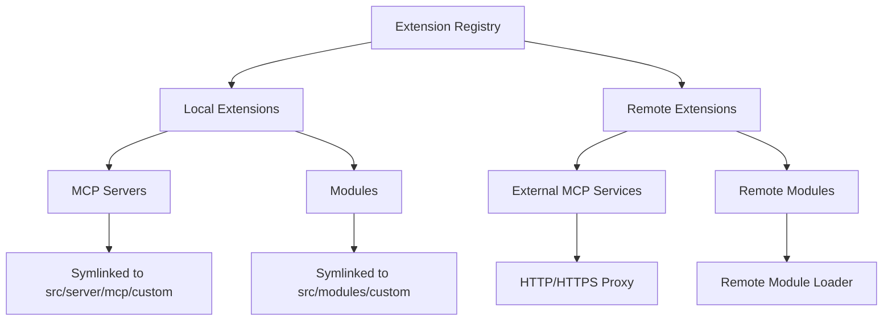

# Extension Registry Implementation

## Overview

The Extension Registry is a powerful system that allows users to extend systemprompt-os functionality without modifying the core codebase. It supports both local extensions (code in the filesystem) and remote extensions (external services accessed via HTTP/HTTPS).

## Architecture



## Extension Types

### 1. Local Extensions

Local extensions are code files that live in the `extensions/` directory:

```
extensions/
├── servers.yaml         # MCP server definitions
├── modules.yaml         # Module definitions
├── servers/            # Local MCP server implementations
│   ├── my-server/
│   │   ├── index.js
│   │   └── package.json
│   └── another-server/
└── modules/            # Local module implementations
    ├── my-module/
    │   ├── index.js
    │   ├── module.yaml
    │   └── cli/
    └── another-module/
```

### 2. Remote Extensions

Remote extensions are external services accessed via URL:

```yaml
# extensions/servers.yaml
servers:
  - name: github-mcp
    type: remote
    url: https://api.github.com/mcp
    auth:
      type: bearer
      token: ${GITHUB_TOKEN}
```

## Configuration Files

### servers.yaml

Defines custom MCP servers:

```yaml
# extensions/servers.yaml
servers:
  # Local server example
  - name: my-local-server
    type: local
    path: ./servers/my-server
    enabled: true
    config:
      option1: value1
      option2: value2

  # Remote server example  
  - name: external-api
    type: remote
    url: https://api.example.com/mcp
    enabled: true
    auth:
      type: oauth2
      clientId: ${CLIENT_ID}
      clientSecret: ${CLIENT_SECRET}
    headers:
      X-Custom-Header: value
```

### modules.yaml

Defines custom modules:

```yaml
# extensions/modules.yaml
modules:
  # Local module example
  - name: my-daemon
    type: local
    path: ./modules/my-daemon
    enabled: true
    moduleType: daemon
    config:
      interval: 30s
      
  # Remote module example
  - name: cloud-service
    type: remote
    url: https://modules.example.com/cloud-service
    enabled: true
    moduleType: plugin
    provides:
      - storage
      - backup
```

## Extension Loading Process

### 1. Discovery Phase

```typescript
// Extension discovery at startup
class ExtensionLoader {
  async loadExtensions(): Promise<void> {
    // 1. Load configuration files
    const serversConfig = await this.loadYaml('extensions/servers.yaml');
    const modulesConfig = await this.loadYaml('extensions/modules.yaml');
    
    // 2. Validate configurations
    this.validateServersConfig(serversConfig);
    this.validateModulesConfig(modulesConfig);
    
    // 3. Load extensions
    await this.loadServers(serversConfig.servers);
    await this.loadModules(modulesConfig.modules);
  }
}
```

### 2. Local Extension Loading

```typescript
// Local extensions are symlinked to appropriate directories
async loadLocalServer(config: LocalServerConfig): Promise<void> {
  const sourcePath = resolve('extensions', config.path);
  const targetPath = resolve('src/server/mcp/custom', config.name);
  
  // Create symlink
  await symlink(sourcePath, targetPath);
  
  // Register with MCP registry
  const server = await import(targetPath);
  this.mcpRegistry.register(config.name, server.createHandler(config.config));
}
```

### 3. Remote Extension Loading

```typescript
// Remote extensions use proxy handlers
async loadRemoteServer(config: RemoteServerConfig): Promise<void> {
  // Create proxy handler
  const proxyHandler = createProxyHandler({
    url: config.url,
    auth: config.auth,
    headers: config.headers
  });
  
  // Register with MCP registry
  this.mcpRegistry.register(config.name, proxyHandler);
}
```

## Extension API

### MCP Server Extension Interface

```typescript
// Local MCP server must export this interface
export interface MCPServerExtension {
  // Handler factory function
  createHandler(config?: any): express.RequestHandler;
  
  // Metadata
  metadata: {
    name: string;
    version: string;
    description: string;
    capabilities: string[];
  };
  
  // Optional lifecycle hooks
  initialize?(): Promise<void>;
  shutdown?(): Promise<void>;
}

// Example implementation
export const myServer: MCPServerExtension = {
  createHandler(config) {
    return async (req, res) => {
      // Handle MCP protocol requests
      const { method, params } = req.body;
      
      switch (method) {
        case 'tools/list':
          res.json({
            tools: [
              {
                name: 'my_tool',
                description: 'My custom tool',
                inputSchema: { /* ... */ }
              }
            ]
          });
          break;
        // ... other methods
      }
    };
  },
  
  metadata: {
    name: 'my-server',
    version: '1.0.0',
    description: 'My custom MCP server',
    capabilities: ['tools', 'resources']
  }
};
```

### Module Extension Interface

```typescript
// Modules use the standard ExtendedModule interface
import { ExtendedModule, DaemonModule } from '@systemprompt/core';

export class MyDaemonModule implements DaemonModule {
  name = 'my-daemon';
  version = '1.0.0';
  type = 'daemon' as const;
  
  private intervalId?: NodeJS.Timer;
  private running = false;
  
  async initialize(): Promise<void> {
    // Initialize resources
  }
  
  async start(): Promise<void> {
    this.running = true;
    this.intervalId = setInterval(() => {
      // Daemon logic
    }, 30000);
  }
  
  async stop(): Promise<void> {
    if (this.intervalId) {
      clearInterval(this.intervalId);
    }
    this.running = false;
  }
  
  isRunning(): boolean {
    return this.running;
  }
  
  async shutdown(): Promise<void> {
    await this.stop();
    // Cleanup resources
  }
}
```

## Security Considerations

### 1. Extension Validation

All extensions are validated before loading:

```typescript
class ExtensionValidator {
  validateExtension(config: ExtensionConfig): void {
    // Check required fields
    this.validateRequiredFields(config);
    
    // Validate paths (prevent directory traversal)
    if (config.type === 'local') {
      this.validatePath(config.path);
    }
    
    // Validate URLs
    if (config.type === 'remote') {
      this.validateUrl(config.url);
    }
    
    // Check permissions
    this.checkPermissions(config);
  }
  
  private validatePath(path: string): void {
    // Ensure path is within extensions directory
    const resolvedPath = resolve('extensions', path);
    if (!resolvedPath.startsWith(resolve('extensions'))) {
      throw new Error('Invalid extension path');
    }
  }
}
```

### 2. Sandboxing

Extensions run with limited permissions:

```typescript
// Extension sandbox
class ExtensionSandbox {
  async runExtension(extension: Extension): Promise<void> {
    // Create isolated context
    const context = {
      // Limited API surface
      console: this.createSafeConsole(),
      setTimeout: this.createSafeTimer(),
      // No access to: fs, child_process, etc.
    };
    
    // Run extension in VM
    const vm = new VM({
      timeout: 5000,
      sandbox: context
    });
    
    await vm.run(extension.code);
  }
}
```

### 3. Authentication for Remote Extensions

```typescript
// Auth handler for remote extensions
class RemoteAuthHandler {
  async authenticate(config: RemoteConfig): Promise<Headers> {
    const headers = new Headers();
    
    switch (config.auth?.type) {
      case 'bearer':
        headers.set('Authorization', `Bearer ${config.auth.token}`);
        break;
        
      case 'oauth2':
        const token = await this.getOAuth2Token(config.auth);
        headers.set('Authorization', `Bearer ${token}`);
        break;
        
      case 'apikey':
        headers.set(config.auth.header || 'X-API-Key', config.auth.key);
        break;
    }
    
    return headers;
  }
}
```

## Best Practices

### 1. Extension Development

- **Version your extensions**: Use semantic versioning
- **Document dependencies**: List all required packages
- **Handle errors gracefully**: Don't crash the host system
- **Follow naming conventions**: Use lowercase with hyphens
- **Test thoroughly**: Include unit and integration tests

### 2. Configuration Management

- **Use environment variables**: For sensitive data like API keys
- **Validate configuration**: Check types and required fields
- **Provide defaults**: Make configuration optional where possible
- **Document all options**: Include examples in comments

### 3. Performance

- **Lazy load extensions**: Only load when needed
- **Cache remote responses**: Reduce API calls
- **Use connection pooling**: For database extensions
- **Monitor resource usage**: Set limits on CPU/memory

## Example Extensions

### 1. Weather MCP Server

```javascript
// extensions/servers/weather-server/index.js
export const weatherServer = {
  createHandler(config) {
    const apiKey = config.apiKey || process.env.WEATHER_API_KEY;
    
    return async (req, res) => {
      const { method, params } = req.body;
      
      if (method === 'tools/list') {
        res.json({
          tools: [{
            name: 'get_weather',
            description: 'Get current weather for a location',
            inputSchema: {
              type: 'object',
              properties: {
                location: { type: 'string' }
              },
              required: ['location']
            }
          }]
        });
      } else if (method === 'tools/call' && params.name === 'get_weather') {
        const weather = await fetchWeather(params.arguments.location, apiKey);
        res.json({ content: weather });
      }
    };
  },
  
  metadata: {
    name: 'weather-server',
    version: '1.0.0',
    description: 'Weather information MCP server',
    capabilities: ['tools']
  }
};
```

### 2. Backup Daemon Module

```typescript
// extensions/modules/backup-daemon/index.ts
import { DaemonModule } from '@systemprompt/core';
import { backup } from './backup';

export class BackupDaemon implements DaemonModule {
  name = 'backup-daemon';
  version = '1.0.0';
  type = 'daemon' as const;
  
  private timer?: NodeJS.Timer;
  private running = false;
  
  constructor(private config: BackupConfig) {}
  
  async start(): Promise<void> {
    this.running = true;
    
    // Run backup immediately
    await this.runBackup();
    
    // Schedule regular backups
    const interval = this.config.interval || 3600000; // 1 hour default
    this.timer = setInterval(() => this.runBackup(), interval);
  }
  
  async stop(): Promise<void> {
    if (this.timer) {
      clearInterval(this.timer);
      this.timer = undefined;
    }
    this.running = false;
  }
  
  isRunning(): boolean {
    return this.running;
  }
  
  private async runBackup(): Promise<void> {
    console.log('Running backup...');
    try {
      await backup({
        source: this.config.source,
        destination: this.config.destination,
        exclude: this.config.exclude
      });
      console.log('Backup completed successfully');
    } catch (error) {
      console.error('Backup failed:', error);
    }
  }
  
  async shutdown(): Promise<void> {
    await this.stop();
  }
}
```

## Troubleshooting

### Common Issues

1. **Extension not loading**
   - Check file permissions
   - Verify configuration syntax
   - Look for errors in logs
   - Ensure dependencies are installed

2. **Remote extension timeout**
   - Check network connectivity
   - Verify authentication credentials
   - Increase timeout in configuration
   - Check remote service status

3. **Symlink errors**
   - Run with appropriate permissions
   - Check filesystem supports symlinks
   - Verify source path exists
   - Clear existing symlinks

### Debug Mode

Enable debug logging for extensions:

```bash
DEBUG=extensions:* systemprompt start
```

### Extension CLI Commands

```bash
# List all extensions
systemprompt extensions:list

# Enable/disable extension
systemprompt extensions:enable my-server
systemprompt extensions:disable my-module

# Validate extension configuration
systemprompt extensions:validate

# Reload extensions without restart
systemprompt extensions:reload
```

## Future Enhancements

1. **Extension Marketplace**: Central repository for community extensions
2. **Hot Reloading**: Update extensions without server restart
3. **Extension Dependencies**: Automatic dependency resolution
4. **Extension Signing**: Cryptographic verification of extensions
5. **Resource Limits**: CPU/memory quotas per extension
6. **Extension Isolation**: Run extensions in separate processes/containers